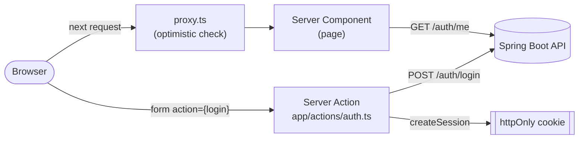

# Kpata — Frontend

Frontend for **Kpata**, a booking platform connecting customers with hair & beauty
salons in Côte d'Ivoire. Built with [Next.js](https://nextjs.org) (App Router), it
consumes a separate Spring Boot backend for authentication and business data.
Authentication is by **phone number**, not email — a product decision for the
Ivorian market.


## Table of contents

- [Overview](#overview)
- [Tech stack](#tech-stack)
- [Architecture](#architecture)
- [Backend API consumed](#backend-api-consumed)
- [Getting started](#getting-started)
- [Test account](#test-account)
- [Testing & code quality](#testing--code-quality)
- [CI/CD pipeline](#cicd-pipeline)
- [Project status](#project-status)

## Overview

Kpata connects **customers** looking for a haircut, braids, or a spa treatment with
**professionals** working at a **salon**. This repository is the web client: it renders
the UI and talks to the [`kpata-backend`](https://github.com/KyliannIvory/kpata-backend)
API for everything that needs a database or a business rule — this app owns no data of
its own.

## Tech stack

| Layer | Technology |
|---|---|
| Framework | Next.js 16 (App Router), React 19 |
| Language | TypeScript 5 |
| Styling | Tailwind CSS 4, custom "Modernist" design system (`app/globals.css`) |
| Validation | [Zod](https://zod.dev), [libphonenumber-js](https://github.com/catamphetamine/libphonenumber-js) (Ivory Coast phone format) |
| Auth storage | `httpOnly` session cookie, hand-rolled (no auth library) |
| Lint | ESLint (`eslint-config-next`) |
| CI/CD | GitHub Actions, image published to GHCR |
| Build | Docker multi-stage, Next.js standalone output |

## Architecture

The backend is stateless JWT-based, but the **browser never talks to it directly** — the
Next.js server is the only thing that calls `kpata-backend`, using the
Server Component / Server Action model:



Two separate checks run before a protected page is shown:

- **`proxy.ts`** — runs before every request (Next.js's equivalent of a Servlet
  `Filter`). Only checks whether the session cookie is present — never calls the API.
- **`app/lib/dal.ts`** — runs only when a page actually needs user data. Calls
  `GET /auth/me` for a real server-side check, so an expired, corrupted, or
  logged-out-elsewhere token is rejected even if the cookie itself looks valid.

| Path | Role |
|---|---|
| `app/(auth)/` | `/login`, `/signup` routes and their shared layout |
| `app/dashboard/` | Protected dashboard page |
| `app/actions/auth.ts` | Server Actions (`login`, `signup`, `logout`) — the only place allowed to call the backend API |
| `app/lib/definitions.ts` | Zod validation schemas + shared types (mirrors the backend's request/response DTOs) |
| `app/lib/api-errors.ts` | Maps the backend's `ErrorResponseDto` into per-field errors |
| `app/lib/session.ts` | Creates/reads/deletes the `httpOnly` session cookie |
| `app/lib/dal.ts` | Server-side session verification (`GET /auth/me`) |
| `app/lib/jwt.ts` | Local JWT decode, used only to compute cookie expiry — not for auth checks |
| `proxy.ts` | Route protection run before every request |

For the full file-by-file rationale (why this structure, what each `TODO` resolved to),
see [`docs/auth-architecture.md`](docs/auth-architecture.md). For the design reference,
see [`docs/design/`](docs/design/).

## Backend API consumed

| Endpoint | Called from | Purpose |
|---|---|---|
| `POST /auth/signup` | `app/actions/auth.ts` | Create an account |
| `POST /auth/login` | `app/actions/auth.ts` | Authenticate |
| `POST /auth/logout` | `app/actions/auth.ts` | Revoke the current JWT |
| `GET /auth/me` | `app/lib/dal.ts` | Verify the session, fetch the current user |

## Getting started

**Prerequisites:** Node.js 20+, a running instance of
[`kpata-backend`](https://github.com/KyliannIvory/kpata-backend).

```bash
git clone git@github.com:KyliannIvory/kpata-frontend.git
cd kpata-frontend
npm install
```

Create a `.env.local` file at the root with the backend's URL:

```
API_URL=http://localhost:8080
```

```bash
npm run dev
```

The app is then available at [http://localhost:3000](http://localhost:3000).

## Test account

The backend has no seed data — this account was created by hand (via
`POST /auth/signup`) to test quickly without going through `/signup`:

| Field | Value |
|---|---|
| Phone | `0701020304` |
| Password | `password123` |

Sign in directly via [`/login`](http://localhost:3000/login). This account lives in the
backend's local database: if it gets reset, recreate it via
[`/signup`](http://localhost:3000/signup) with the same values (first name Aïcha, last
name Koné, email `aicha@example.com`).

## Testing & code quality

```bash
npm run lint    # ESLint
npm run build   # type-checking + production build
```

There is no automated test suite yet (unit/component tests) — see
[Project status](#project-status).

## CI/CD pipeline

Every push and pull request to `main` runs three sequential GitHub Actions jobs
([`.github/workflows/ci.yml`](.github/workflows/ci.yml)):

1. **`lint`** — `npm run lint` (ESLint)
2. **`build`** — `npm run build`
3. **`publish-image`** — build the Docker image and push it to GHCR (`latest` + commit
   SHA tags), **only** on a push to `main`

The image is then pulled and deployed by
[`kpata-infra`](https://github.com/KyliannIvory/kpata-infra).

## Project status

**Implemented:**
- Login / signup (`/login`, `/signup`) — Zod-validated forms, errors mapped from the
  backend's error contract (`ErrorResponseDto`), session stored in an `httpOnly` cookie
- Logout — revokes the token on the backend, then clears the local session
- Route protection — optimistic check (`proxy.ts`) plus a real server-side check
  before rendering a protected page (`GET /auth/me`, `app/lib/dal.ts`)
- Dashboard (`/dashboard`) — shows the logged-in account's info (name, phone, email,
  roles) and the logout button
- "Modernist" design system (Archivo, single red accent, soft corners) applied to the
  pages above

**Not yet implemented:** anything beyond this auth skeleton — bookings, professional
profiles, salon management, etc. (these are modeled in the backend's database but not
yet exposed via its API either).

**Known next steps:**
- Build the UI for salons, treatments, availabilities and appointments as the backend
  exposes those endpoints
- Add an automated test suite (unit/component tests)
- Decide whether `API_URL` should vary per environment, or stay a fixed constant
